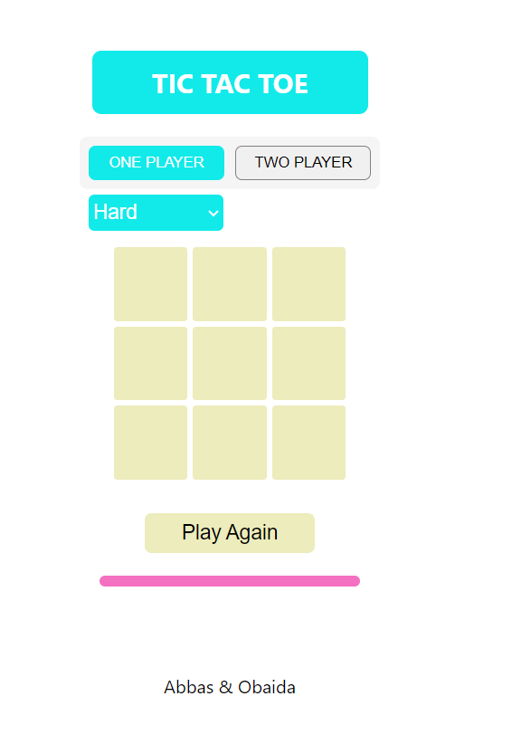
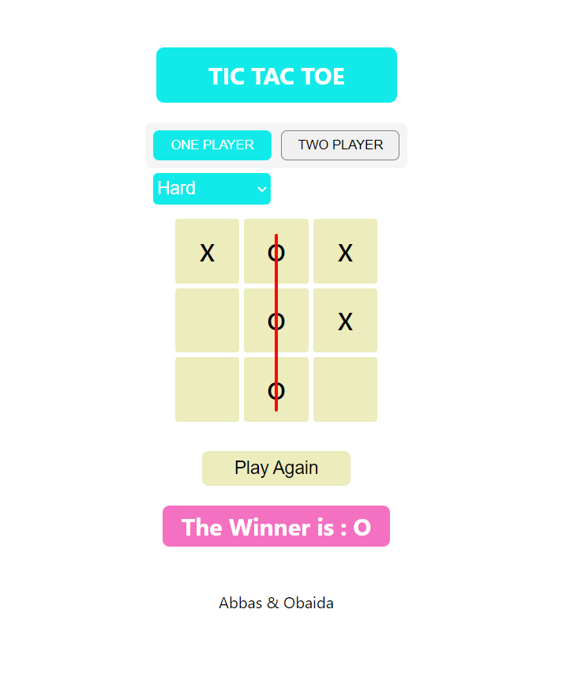
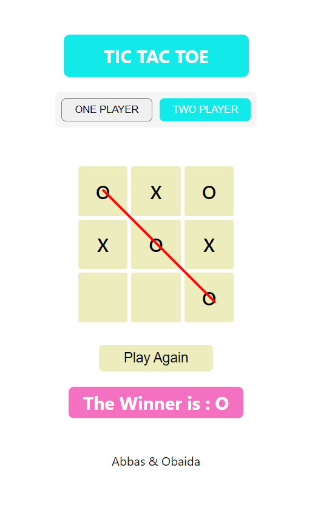

# Tic Tac Toe Game 🎮

Welcome to the Tic Tac Toe game, developed as part of an AI course project at the university. This application is built using React and demonstrates basic game logic and AI implementation.






## 🌟 Features

- **Single Player Mode**: Play against an AI opponent.
- **Two Player Mode**: Play against another human.
- **Responsive Design**: Compatible with desktop and mobile devices.
- **Simple and Intuitive UI**: Easy to use and visually appealing interface.
- **AI Implementation**: The AI uses the minimax algorithm for making decisions.

## 🚀 Demo

Check out the live demo of the game [here](https://xogame-ai.netlify.app/).

## 🛠️ Technologies Used

- **React**: JavaScript library for building user interfaces.
- **JavaScript (ES6+)**: For game logic and AI implementation.
- **CSS**: For styling the application.
- **Netlify**: For deploying the application.

## 📦 Installation

To run this project locally, follow these steps:

1. **Clone the repository:**
   ```sh
   git clone https://github.com/yourusername/tic-tac-toe.git
